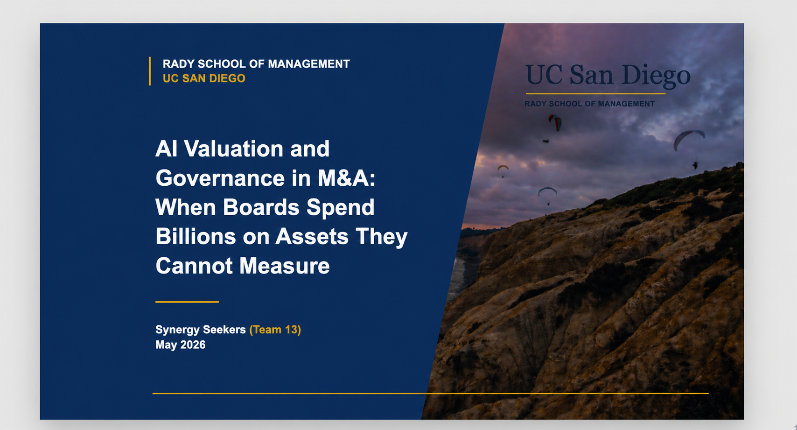

# AI Valuation and Governance in M&A

An interactive HTML presentation examining how boards can evaluate, govern, and monitor AI-related intangible assets in mergers and acquisitions.

## Project Overview

AI-related acquisitions often derive value from assets that are difficult to isolate and measure, including proprietary data, models, engineering talent, and future capabilities. This presentation explores:

- Why AI-related intangible assets matter in M&A
- Why traditional valuation methods may be insufficient
- Key governance and post-deal oversight risks
- Illustrative market cases
- Practical recommendations for boards

## Project Background and My Contribution

This project originated from my master's capstone at the UC San Diego Rady School of Management. The research, analysis, and presentation content were developed collaboratively by our capstone team.

I served as the team's **Project Manager**, coordinating the project workflow, responsibilities, and delivery. After the team completed the capstone content, I independently designed and built this interactive HTML slide deck using **Codex**, transforming the original presentation into a browser-based experience.

In short:

- **Capstone research and content:** Collaborative team work
- **Project management:** Led by me as Project Manager
- **HTML deck design and development:** Independently completed by me with Codex

## Built With

- HTML5
- CSS3
- Vanilla JavaScript
- AI-assisted development with Codex

## How to View

Open `index.html` in a browser. Use the **left/right arrow keys** or **spacebar** to navigate the slides.

## Portfolio Note

This repository contains a cleaned portfolio edition of the capstone project. Personal information belonging to other team members has been removed, while the collaborative origin of the underlying content is clearly acknowledged.
